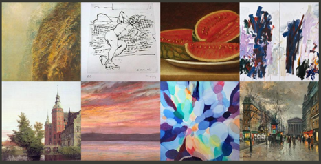

# PaintersRecognition  
New solution for the Painter by Numbers competition on Kaggle. Using part of its dataset.   
本实验的数据集最初来自于Kaggle的比赛[Painter by Numbers](https://www.kaggle.com/c/painter-by-numbers)  
比赛是在2016年举办的，当时获得比赛第一名的大神对其解决方案做了汇报[[链接]](https://inejc.github.io/kaggle/2016/11/17/painter-by-numbers-competition-on-kaggle/)  
随着近年来分类网络的发展，分类效果会不会有进一步的提升呢  
本文对比了现今比较流行的几种分类网络，探索了分类网络在画家分类识别领域的准确度  

## Requirements  
详见requirements.txt  
主要使用Keras框架，在ImageNet预训练好的网络进行迁移学习  

## Dataset and preprocessing  
本实验的数据集来自于Kaggle[Painter by Numbers](https://www.kaggle.com/c/painter-by-numbers)  
  
最初的数据集共有1584个类，79433幅画  
  
这个数据集画的数量多，类别多，且类间具有很大的不平衡性，难以训练。所以选择数据集中的一部分进行训练，选择画家作品数200以上的构成新的数据集：  
共71个类，22141幅作品  
把数据集放在文件夹pic_dataset中，其中的画家作品按照每个画家一个文件夹的方式组织  
然后，运行data_preprocessing.py将图片切分成同样大小，此处用的是224*224  

## 迁移学习  
运行painter2-2.py开始训练模型  
* 对比了Keras中多种分类模型，包括：  
    *VGG19  
    *ResNet50  
    *InceptionV3  
    *InceptionResnetV2  
    *DenseNet121, DenseNet169, DenseNet201  

## Results  
这是DenseNet169的acc和loss变化图：  
  
其准确度可达81.29%  
对比各种网络模型的效果如下图：  
  
大多数模型的train_acc都可以达到99%，所以仅对比test_acc  
如进一步缩小数据集到作品数350以上的画家，那DenseNet169准确度可达85.21%  

